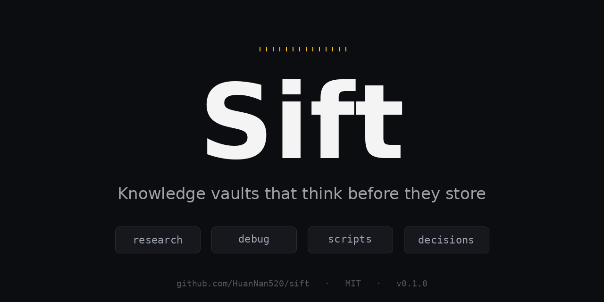

<p align="center">
  
</p>

<p align="center">
  <a href="./LICENSE"></a>
  <a href="./CHANGELOG.md"></a>
  <a href="./QUICKSTART.md"></a>
  <a href="./SPEC.md"></a>
</p>

# Sift

A spec for AI-assisted knowledge vaults that **think before they store**.

> **First-time reader?** Skip ahead to [QUICKSTART.md](./QUICKSTART.md) for the 10-minute setup. Stay here if you want the philosophy first.

> Most AI-first knowledge tools today are eager learners: they ingest everything, trust everything, and let the vault grow without push-back. Sift takes the opposite stance — **a piece of knowledge only earns a place in the vault after it crosses a deliberate threshold**.

This is a spec, not a tool. It defines:

- The 4 card types every vault should keep separate
- A frontmatter schema for AI-first retrieval (including critical-use markers)
- Quantified sink triggers — when something deserves to be saved at all
- 4 engineering principles that govern what does *not* get written

Pair it with any vault tool (Obsidian, plain markdown folder, Logseq) and any AI agent (Claude Code, Cursor, your own scripts). The spec is tool-agnostic.

---

## Why does this exist

The "second brain" / AI-first-vault space has converged on one assumption: **more is better**. Drop every article, every transcript, every conversation into the vault. Let the AI sort it out. Let knowledge "compound."

In practice this produces:

- **Hallucinated trust** — old research gets re-cited as authoritative six months after it's stale
- **Duplicate work** — agents redo the same investigation because there's no cache discipline
- **Note bloat** — the vault grows faster than the reader (human or AI) can navigate
- **No engineering reflexes** — every problem becomes a `/save`, regardless of value

Sift is what happens when an engineer who has worked with `go/no-go gating`, `YAGNI`, and `anti-elaboration` looks at the second-brain space and asks: *what would knowledge management look like if the same discipline applied?*

---

## The 4 card types

A Sift-compliant vault separates knowledge into four mutually exclusive folders:

| Folder | What goes here | Sink trigger |
|---|---|---|
| `research/` | Investigations with sources, conclusions, expiration | A parallel-agent or multi-source research session worth caching |
| `debug/` | Solutions to non-trivial problems, with root cause + reproduction | A debugging session that took more than 5 minutes |
| `scripts/` | Reusable code snippets (bash, python, config) with usage examples | Code longer than 10 lines that you'll plausibly run again |
| `decisions/` | Project-level architectural or process commitments | A trade-off you'd want to remember the rationale for |

Anything that does not fit one of these four buckets **does not get sunk**. It stays in the conversation, gets used once, and is allowed to be forgotten.

---

## The 4 engineering principles

These govern what does *not* get written:

1. **Go/no-go gating** — before sinking, ask "is this worth the future-read cost?" If unclear, skip.
2. **Anti-elaboration** — short cards beat long ones. A sink is a value transfer, not a writing exercise.
3. **Value over process** — don't sink a debug card just because you solved a problem. Sink it because the *next* time someone hits the same problem, this card saves them an hour.
4. **YAGNI** — speculative knowledge ("might be useful someday") does not get a card. Wait for the second occurrence.

These are stolen directly from software engineering. The claim of Sift is that **knowledge management deserves the same discipline as code** — because both compound, both decay, and both punish the careless.

---

## Critical use: knowledge expires

The single most distinctive feature of Sift versus other AI-vault specs:

**Every research card carries an `expires` date and a `recheck-trigger` list.**

```yaml
---
type: research
date: 2026-05-10
expires: 2026-08-10   # default: 3 months from sink date
recheck-trigger:
  - upstream repository hits 5k stars
  - vault grows past 500 notes
  - the underlying tool ships a 1.0 release
---
```

When a future AI session reads this card, the contract is:

- **Before `expires`, and no trigger condition met** → reuse the conclusion directly
- **After `expires`, or a trigger fired** → redo the investigation, but **use the old card as baseline** and ask the new agent: *"the previous finding was X. Confirm it still holds and find what's new since."*

This single rule prevents the most common failure mode of AI vaults: **rehearsing stale knowledge with the confidence of fresh research**.

See [SPEC.md](./SPEC.md) for the full frontmatter schema, sink trigger details, and worked examples.

---

## What Sift is not

- **Not a tool.** No installer, no runtime, no daemon. It is a spec you apply by hand or by agent.
- **Not a replacement for a vault tool.** Use Obsidian, Logseq, plain folders — whatever. Sift adds discipline, not infrastructure.
- **Not for personal journaling.** Daily notes, mood logs, casual idea capture — keep those somewhere else. Sift is for knowledge that will be re-read under load.
- **Not for teams (yet).** Multi-user vaults are a v2 problem.

---

## Examples

Three real cards extracted from a vault running these principles in production (private project names, paths, and API references redacted). They show what each card type looks like under real load, not as theoretical templates:

- [examples/research-example.md](./examples/research-example.md) — investigation into the Obsidian + Claude Code ecosystem (with `expires` + `recheck-trigger` in action)
- [examples/debug-example.md](./examples/debug-example.md) — Obsidian EISDIR crash on WSL `\\wsl.localhost\` paths, root-caused to 9P protocol
- [examples/decision-example.md](./examples/decision-example.md) — repositioning a personal vault as a Claude-facing SKILL library, with steelmanned rejected options

Every example links to the other two — that's how the four-folder layout produces a graph rather than isolated documents.

## Dogfood: this repo runs the spec on itself

The Sift repo is also a Sift vault. The `meta/` directory contains cards documenting Sift's own development, written to the same spec the repo defines:

- [meta/research/2026-05-11-naming-com-exhausted.md](./meta/research/2026-05-11-naming-com-exhausted.md) — the .com naming search that ran while picking the project's name; 200+ candidates queried, four available, all rejected, plus an analysis of why pronounceable 4-letter .com finished registration in 2014
- [meta/decisions/2026-05-11-launch-not-perfect.md](./meta/decisions/2026-05-11-launch-not-perfect.md) — the launch decision that produced v0.1.0 the same night the idea formed; option set, rationale, consequences, reconsider-when triggers
- [meta/debug/2026-05-11-cdp-social-preview-upload.md](./meta/debug/2026-05-11-cdp-social-preview-upload.md) — how the social preview banner got uploaded via Chrome DevTools Protocol (GitHub has no API for this), with five pitfalls and the verified working approach

Read these as worked examples of what the spec produces under real load. The same files validate against `spec/sift.schema.yaml` (run `./lint.sh` from the repo root to check).

## Spec is machine-readable

Frontmatter compliance can be validated programmatically:

```bash
# from the repo root
./lint.sh /path/to/your/vault
```

Schema lives at [spec/sift.schema.yaml](./spec/sift.schema.yaml) (JSON Schema draft-2020-12). Use it with any standards-compliant validator (`yamllint`, `ajv`, etc.) or just `./lint.sh` for a quick check.

Requirements: `python3`, `pyyaml`, `jsonschema`.

## Status

This is a working draft. The spec was extracted from a real personal vault running these principles in production. It is being made public to invite review, criticism, and adoption.

> **项目不在于成熟,而在于出现** — putting it out is more important than making it perfect.

Contributions welcome via pull request.

---

## License

[MIT](./LICENSE)
